### Hi there 👋 I'm Nial4

Backend / AI Engineer based in **Tokyo 🇯🇵**

I focus on building scalable backend services, distributed systems, and AI applications.  
Passionate about turning research prototypes into real-world engineering solutions.

---

### 📫 Contact

---

### 🚀 About Me

* 🧠 Backend engineer with strong interest in **AI / LLM systems**
* ⚙️ Experienced in designing **high-concurrency backend services**
* ☁️ Hands-on with **cloud infrastructure and microservices architecture**
* 🔬 Research background in **computer vision & generative models**
* 🎯 Enjoy bridging **ML research → production engineering**

---

### 🛠 Tech Stack

#### Languages

#### Backend & AI

#### Frontend (Vibe)

#### Infra & DevOps

---

### 🌱 Currently Exploring

* LLM Agents / Tool Calling Architecture
* Diffusion & Generative AI
* Distributed Microservices
* Cloud-native AI deployment
* Cross-platform mobile prototyping

---

### 📊 Development Metrics

---

### 🎨 Fun Fact

I enjoy anime aesthetics and cyberpunk storytelling.
Favorites include **Serial Experiments Lain** and **Evangelion**.

I also enjoy exploring Tokyo at night 🌃
